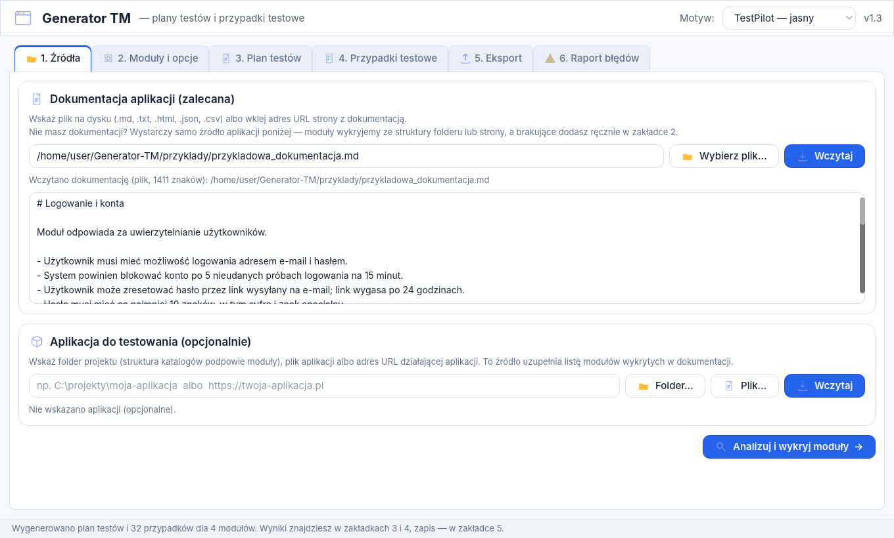
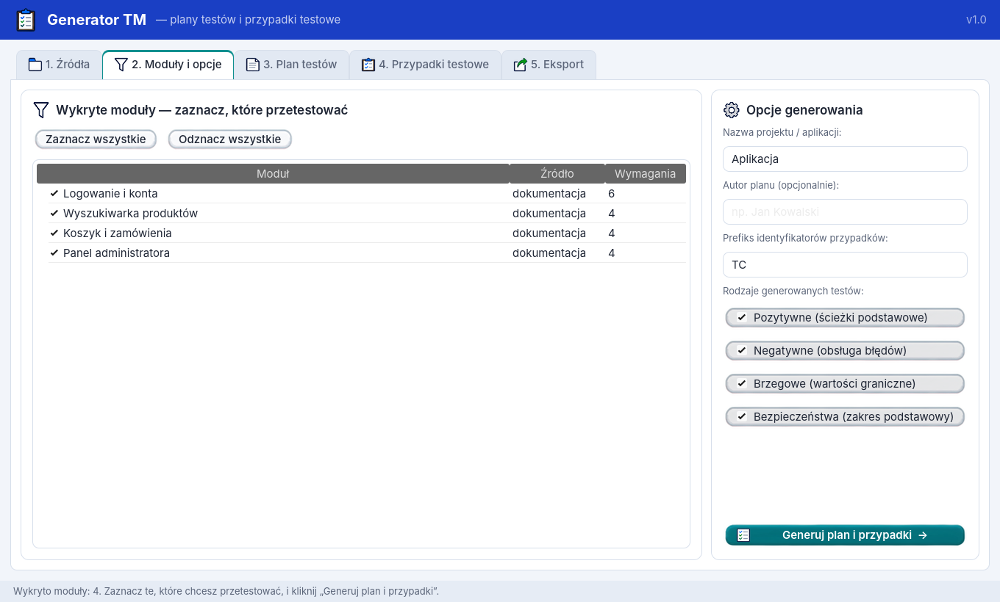
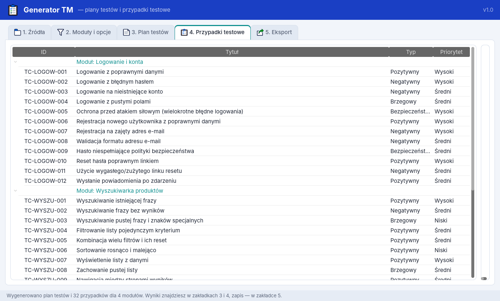
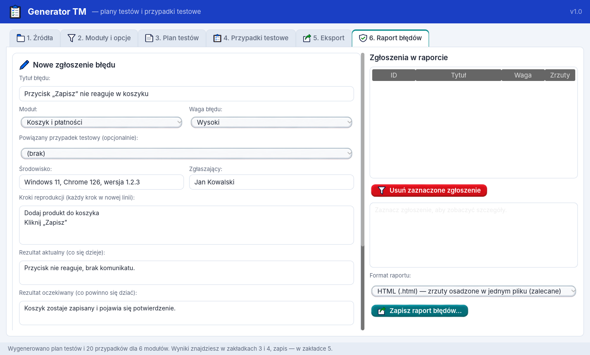

# Generator TM

Program desktopowy do tworzenia **planów testów** i **przypadków testowych** na podstawie dokumentacji aplikacji — z możliwością wyboru modułów, tak aby nie generować za każdym razem przypadków dla całej aplikacji.

Projekt przygotowany w **Godot 4.4** (GDScript) i gotowy do eksportu do pliku `.exe` dla Windows. Interfejs korzysta z dostarczonego pakietu assetów **TestPilot Studio** (przyciski, ikony, styl okna) oraz czcionki Inter z pełną obsługą polskich znaków.






## Co potrafi program

1. **Wczytanie dokumentacji** aplikacji:
   - z dysku: pliki `.md`, `.txt`, `.html`/`.htm`, `.json`, `.csv`,
   - z internetu: adres URL strony z dokumentacją (HTML jest automatycznie konwertowany na tekst).
2. **Wskazanie aplikacji do testowania** (opcjonalnie, ta sama zasada — dysk lub link):
   - folder projektu — struktura katalogów podpowiada dodatkowe moduły,
   - plik aplikacji (np. `.exe`) — zapisywany w planie jako środowisko testowe,
   - adres URL działającej aplikacji.
3. **Analiza dokumentacji i wykrycie modułów** — po nagłówkach Markdown/HTML, liniach „Moduł: …”, sekcjach numerowanych lub tytułach pisanych wielkimi literami; z treści wyciągane są zdania-wymagania (musi/powinien/umożliwia…).
4. **Wybór modułów** — checkboxy przy każdym wykrytym module; generujesz tylko to, co zaznaczysz.
5. **Generowanie**:
   - **plan testów** (struktura wg IEEE 829/ISO 29119: cel, zakres, strategia, środowisko, kryteria wejścia/wyjścia, ryzyka, pracochłonność, zestawienie przypadków),
   - **przypadki testowe** (ID, moduł, typ, priorytet, warunki wstępne, kroki, dane testowe, oczekiwany rezultat) — reguły rozpoznają m.in. logowanie, rejestrację, formularze, wyszukiwanie, filtry, listy, import/eksport plików, płatności, API, uprawnienia, raporty, ustawienia i daty; generowane są testy pozytywne, negatywne, brzegowe i bezpieczeństwa (do wyboru).
6. **Eksport** do `.md` (Markdown), `.csv` (średniki — przyjazne polskiemu Excelowi, importowalne do Jiry/TestRaila) oraz `.html` (gotowy do druku).
7. **Raport błędów** — formularz zgłoszenia (tytuł, moduł, powiązany przypadek testowy, waga, środowisko, kroki reprodukcji, rezultat aktualny/oczekiwany) z możliwością **dołączenia zrzutów ekranu** z pliku (`.png`, `.jpg`, `.webp`, `.bmp`; można wybrać kilka naraz). Eksport raportu do:
   - `.html` — zrzuty **osadzone w jednym pliku** (base64) — najwygodniejsze do wysłania,
   - `.md` — zrzuty zapisywane w podfolderze `<nazwa>_zalaczniki/` obok pliku,
   - `.csv` — tabela zgłoszeń (bez obrazów, z nazwami załączników).

## Motywy graficzne

W nagłówku okna jest przełącznik **Motyw** — do wyboru „TestPilot — jasny” i „TestPilot — ciemny”. Oba zbudowane są z dostarczonego pakietu assetów (warianty light/dark: przyciski, ikony i kolorystyka okna). Zmiana działa natychmiast — podmieniane są też ikony na wariant pasujący do tła. Wybór zapisuje się na dysku (`user://ustawienia.cfg`) i wraca po ponownym uruchomieniu.

### Jak dodać własny motyw graficzny

Motywy są zdefiniowane w `scripts/ui_theme.gd` jako proste specyfikacje. Aby podpiąć nowy pakiet assetów:

1. Wgraj pliki do projektu, np. `assets/moj_motyw/` (przyciski PNG działają jako ninepatch — najlepiej zaokrąglone prostokąty ~220×70 px z rogami ok. 20 px).
2. W `ui_theme.gd` dopisz wpis w `themes()`:
   `{"id": "moj_motyw", "name": "Mój motyw"}`
3. W `spec()` dodaj gałąź `"moj_motyw":` zwracającą słownik z kolorami (`bg`, `card`, `header`, `accent`, `text`, `text_dim`, `border`, `danger`, `field_bg`, `tab_unselected_bg`, `tree_sel`, `status_bg`) i przyciskami — dla każdego z trzech rodzajów (`normal`, `primary`, `danger`) podaj **albo** ścieżkę tekstury `btn_*_tex`, **albo** zostaw `""` i ustaw kolory `btn_*_bg` / `btn_*_border` / `btn_*_font` (przycisk będzie rysowany płasko).
4. To wszystko — motyw pojawi się na liście, a selftest sprawdzi, czy się buduje.

## Praca bez dokumentacji

Dokumentacja jest zalecana, ale **niewymagana**. Jeśli masz tylko aplikację:

- **folder projektu** — moduły zostaną wykryte ze struktury katalogów,
- **adres URL** działającej aplikacji — moduły z nagłówków strony,
- **sam plik binarny (.exe)** — program utworzy moduł ogólny (testy eksploracyjne/dymne),

a w zakładce **„2. Moduły i opcje”** możesz **dopisać własne moduły ręcznie** (pole „Dodaj własny moduł”). Generator dobiera reguły także po nazwie modułu — wpisanie np. „Logowanie”, „Koszyk”, „Wyszukiwarka” czy „Raporty” od razu da pełne zestawy przypadków dla tych obszarów.

Generator działa **w pełni offline** — nie wysyła danych do żadnych usług; internet jest potrzebny tylko wtedy, gdy sam podasz adres URL do pobrania.

## Uruchomienie w edytorze Godot

1. Pobierz **Godot 4.4.x** (wersja standardowa, nie „.NET”): https://godotengine.org/download
2. Otwórz Godota → **Import** → wskaż plik `project.godot` z tego repozytorium.
3. Naciśnij **F5** (Uruchom projekt).

Do szybkiego testu użyj pliku `przyklady/przykladowa_dokumentacja.md`.

## Eksport do pliku .exe (Windows)

1. W Godocie otwórz projekt i wejdź w **Editor → Manage Export Templates…** (Edytor → Zarządzaj szablonami eksportu) i kliknij **Download and Install** — jednorazowo, ok. 700 MB.
2. Wejdź w **Project → Export…** (Projekt → Eksportuj).
3. Preset **„Windows Desktop”** jest już skonfigurowany (plik `export_presets.cfg`):
   - jeden plik wynikowy z wbudowanym pakietem danych (`embed_pck`),
   - architektura x86_64,
   - ścieżka wyjściowa `build/GeneratorTM.exe`.
4. Kliknij **Export Project…**, potwierdź ścieżkę i gotowe — powstaje samodzielny `GeneratorTM.exe`, który można skopiować na dowolny komputer z Windows (nie wymaga instalacji).

Uwaga: eksport z ikoną `.ico` i metadanymi wersji na Windows może wymagać narzędzia `rcedit` (Godot podpowie link w oknie eksportu) — bez niego eksport też się powiedzie, plik będzie miał domyślną ikonę Godota.

## Test automatyczny logiki

Logika (wczytywanie, analiza modułów, generator, eksporty) ma test dymny uruchamiany bez okna:

```
godot --headless -s res://scripts/selftest.gd
```

## Struktura projektu

```
project.godot            konfiguracja projektu Godot 4.4
export_presets.cfg       gotowy preset eksportu do .exe (Windows Desktop)
scenes/Main.tscn         scena główna
scripts/main.gd          interfejs użytkownika i przepływ pracy
scripts/ui_theme.gd      motyw zbudowany na pakiecie assetów TestPilot Studio
scripts/doc_loader.gd    wczytywanie z dysku/URL, konwersja HTML → tekst, skan folderu
scripts/module_analyzer.gd  podział dokumentacji na moduły + ekstrakcja wymagań
scripts/test_generator.gd   regułowy generator planu i przypadków testowych
scripts/exporter.gd      eksport do Markdown / CSV / HTML
scripts/bug_reporter.gd  zgłoszenia błędów ze zrzutami ekranu + eksport raportu
scripts/selftest.gd      test dymny logiki (headless)
assets/                  pakiet assetów UI (przyciski, ikony, zakładki, styl okna)
fonts/                   czcionka Inter (polskie znaki)
docs/asset_map/          mapa pocięcia assetów (CSV) z oryginalnego pakietu
przyklady/               przykładowa dokumentacja do szybkiego testu
```

## Ograniczenia

- Formaty `.pdf`, `.docx` nie są czytane bezpośrednio — zapisz dokumentację jako `.txt`/`.md`/`.html` (np. „Zapisz jako” w Wordzie) i wczytaj ponownie.
- Generator jest regułowy (offline). Przypadki wygenerowane automatycznie warto przejrzeć — dokumentacja bywa niekompletna, a reguły nie zastąpią wiedzy testera.
